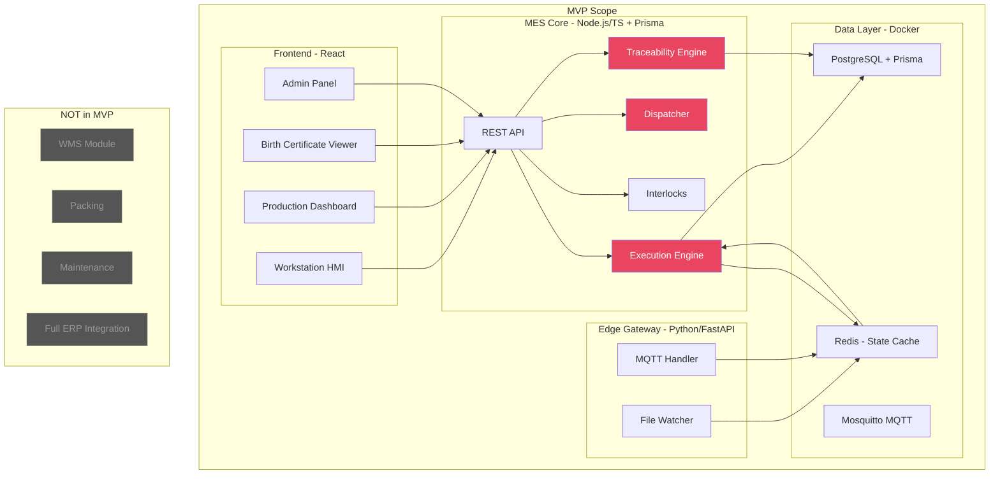

# MES Platform — MVP Implementation Plan

> **Principle:** Build the thinnest possible slice that demonstrates end-to-end **unit-level traceability** — a PCB enters the line, flows through SMT stages, gets inspected, and produces a complete "Digital Birth Certificate." Everything else is Phase 2+.

---

## 1. MVP Feature Prioritization (BCI Checklist Analysis)

### Tier 1: MVP — Must Ship (Initial Build)

These are the minimum features needed to demo a PCB flowing through an SMT line with full traceability.

| BCI Sec  | Area | MVP Items | Rationale |
|---|---|---|---|
| **Sec 2** | Order Management | 2.2 Work order creation, 2.4 Import via file, 2.5 Hold/Release, 2.6 Download SN against WO | Can't start production without an order |
| **Sec 6** | Production Routing | 6.1 SKU-wise process sequencing, 6.2 Machine-Process mapping, 6.4 Managing production route | **Core of the Dispatcher** — this IS the North Star |
| **Sec 7** | Workstation/Machine | 7.1 Machine ID via barcode, 7.2 Machine program config, 7.5 Material mapping with machines | Minimum equipment master to support routing |
| **Sec 8.1** | PCB Label Printing | 8.1 PCB Label Printing, 8.1.2 Serialized label generation | Unit lifecycle starts with a serial number |
| **Sec 8.5** | SMT Line (core flow) | 8.5.5 4M validation, 8.5.7 I/O material validation, 8.5.8 I/O material tracking, 8.5.11 Material consumption tracking, 8.5.13 Cross-process validation, 8.5.14 Serial/batch component tracking, 8.5.16 Defect recording | **Core of Traceability & Interlocks** |
| **Sec 8.5** | SMT Processes (subset) | 8.5.20 Paste Printing, 8.5.22 Pick & Place, 8.5.23 Reflow, 8.5.24 AOI, 8.5.31 ICT, 8.5.32 FCT | The 6 essential SMT stages for demo |
| **Sec 8.6** | I/O Tracking | 8.6 Input & output tracking at each stage | Foundation of genealogy |
| **Sec 8.7** | Route Card | 8.7 Route Card digitization and tracking | Digital equivalent of paper traveller |
| **Sec 5** | Quality (basic) | 5.5 Unit hold/release, 5.12 In-process QC, 5.14 OK/NG segregation | Minimum quality gates |
| **Sec 12** | Rework (basic) | 12.1 Repair In, 12.2 Tracking, 12.3 Repair Out, 12.6 Rework count | Units will fail — need basic rework loop |
| **Sec 14** | Integration (basic) | 14.2 Machine integration via files, 14.4 Real-time data capture | HAL must work for the demo |

**MVP BCI Coverage: ~35 items out of ~170 total (≈20%) — but covers the entire critical path.**

---

### Tier 2: Phase 2 — Post-MVP Enhancements

| BCI Sec  | Area | Items | Notes |
|---|---|---|---|
| Sec 1 | Material & Inventory | Full inventory management, FIFO/FEFO, shortage alerts | Light-weight material ledger in MVP is sufficient |
| Sec 2 | Order Management | ERP pull (2.3), line-wise WO (2.8) | Manual/file import covers MVP |
| Sec 3 | Storage Location | Zone/bin level optimization | Not needed until WMS scale |
| Sec 4 | WMS | Receiving, putaway, picking, kitting | Full WMS is a separate module |
| Sec 5 | Quality (full) | Sampling QC, configurable checklists, PDI, calibration | Basic hold/release covers MVP |
| Sec 6 | Routing (advanced) | Rework routing (6.6), quality checkpoints (6.8), label at user-defined stages (6.5) | Sequential routing is MVP |
| Sec 7 | Machine (advanced) | Tool mapping (7.6), skill mapping (7.7), maintenance alerts (7.9) | Basic machine master covers MVP |
| Sec 8.2 | Stencil Inventory | Full lifecycle: cleaning, shelf life, machine-stencil validation | Simplified: just record stencil ID used |
| Sec 8.3 | MSL Components | Floor life tracking, baking/drying cycles | Simplified: basic lot tracking in MVP |
| Sec 8.4 | Solder Paste | Full lifecycle: thawing, time intervals, requisitions | Simplified: just record paste lot used |
| Sec 8.5 | SMT (extended) | SPI (8.5.21), X-ray (8.5.30), wave solder (8.5.33), conformal coating (8.5.35), sub-assembly (8.5.37) | Additional process segments — config-driven, add later |
| Sec 9 | Packing | Multi-level packing, weight validation, packing rules | Post-production module |
| Sec 10 | Dispatch | Order validation, ASN, loading validation | Post-production module |
| Sec 11 | Tools/Equipment | Full lifecycle, calibration, maintenance scheduling | Basic equipment master covers MVP |
| Sec 12 | Rework (full) | Multi-station repair, spare replacement, aging alerts, scrap | Basic rework loop covers MVP |
| Sec 14 | Integration (full) | ERP/SAP API/RFC integration, PLC integration | File-based integration covers MVP |

### Tier 3: Phase 3 — MOM Scale-Up

| BCI Sec  | Area |
|---|---|
| Sec 13 | Stock Transfers, Returns, Job Work |
| Sec 15 | Handling Units Management |
| Full Sec 1-Sec 4 | Complete WMS + Inventory |
| Full Sec 11 | Maintenance Management Module |
| OEE | Analytics & Performance Module |

---

## 2. MVP Scope — What We're Building

### The Demo Scenario

> **"One PCB, 6 Stations, Full Birth Certificate"**
>
> 1. Planner creates a Work Order for product `PCBA-X100` (qty: 10)
> 2. System generates 10 serial numbers
> 3. Operator scans PCB serial at **Station 1: Solder Paste Printing** → 4M validated → paste lot recorded
> 4. PCB auto-advances to **Station 2: Pick & Place** → component lots recorded per feeder
> 5. PCB flows through **Station 3: Reflow Oven** → temperature logged
> 6. **Station 4: AOI** → machine reports PASS/FAIL
> 7. If FAIL → routed to **Rework** → repaired → re-enters at AOI
> 8. If PASS → **Station 5: ICT** → test result recorded
> 9. **Station 6: FCT** → final test → unit marked PASSED
> 10. Query the **Digital Birth Certificate** for any serial → see every material, machine, operator, test result

### MVP Architecture (Simplified)



---

## 3. MVP Database Schema (Prisma)

Only the tables needed for the demo scenario. Full target-state schema is in `docs/target-state/`.

### Core Models

| Model | Purpose | MVP Fields |
|---|---|---|
| `Equipment` | Machines & stations | id, name, hierarchyLevel, status, parentId, capabilities (JSON) |
| `ProcessSegment` | Configurable process steps | id, code, name, segmentType, requiredCapabilities |
| `MaterialDefinition` | Product & component master | id, partNumber, description, trackingType, uom |
| `MaterialLot` | Component lots | id, lotNumber, materialDefId, quantity, status, expiryDate |
| `MaterialSublot` | Serialized PCB units | id, serialNumber, status, currentSegmentId, currentEquipmentId |
| `ProductionRule` | Routing (product → ordered segments) | id, materialDefId, name, version, status |
| `ProductionRuleSegment` | Step in a route | id, ruleId, segmentId, sequenceOrder, isMandatory, validationRules (JSON) |
| `BomItem` | Bill of Materials entry | id, ruleId, materialDefId, quantityPer, consumptionSegmentId |
| `ProductionRequest` | Work Order | id, requestNumber, ruleId, requestedQty, completedQty, status |
| `Personnel` | Operators | id, employeeId, name, skills (JSON), status |
| `WorkPerformance` | Execution record per unit per segment | id, requestId, sublotId, segmentId, equipmentId, personnelId, status, startedAt, completedAt, resultData (JSON), defects (JSON), isRework, reworkCount |
| `MaterialConsumption` | What went into each unit | id, workPerformanceId, sublotId, consumedLotId, quantity |
| `GenealogyLink` | Parent-child unit links | id, parentSublotId, childSublotId, relationshipType |
| `ValidationEvent` | Interlock audit log | id, sublotId, segmentId, validationType, result, failureReason |

**14 models total** — down from 20+ in target state.

### What's NOT in MVP Schema
- `EquipmentClass`, `PersonnelClass`, `MaterialClass` — use JSON fields instead for now
- `EquipmentCapability` as separate table — embedded in Equipment JSON
- `StorageLocation`, `HandlingUnit` — no WMS
- Full consumable lifecycle tables (Stencil, SolderPaste, MSL separate tables)

---

## 4. MVP API Surface

### Admin / Master Data APIs
| Method | Endpoint | Purpose |
|---|---|---|
| CRUD | `/api/equipment` | Manage machines & stations |
| CRUD | `/api/process-segments` | Define process steps |
| CRUD | `/api/material-definitions` | Product & component master |
| CRUD | `/api/production-rules` | Create routing with segments + BOM |
| CRUD | `/api/personnel` | Manage operators |

### Production APIs
| Method | Endpoint | Purpose |
|---|---|---|
| POST | `/api/production-requests` | Create work order |
| PATCH | `/api/production-requests/:id/release` | Release work order → generate serials |
| PATCH | `/api/production-requests/:id/hold` | Hold work order |
| GET | `/api/production-requests/:id/serials` | List generated serial numbers |
| GET | `/api/production-requests` | List/filter work orders |

### Execution APIs (Workstation HMI)
| Method | Endpoint | Purpose |
|---|---|---|
| POST | `/api/execution/scan-in` | Unit scanned at station (triggers interlocks + starts work perf) |
| POST | `/api/execution/scan-out` | Unit completed at station (result: pass/fail) |
| POST | `/api/execution/record-defect` | Log defect at current station |
| GET | `/api/execution/unit-status/:serial` | Current state + next expected station |
| POST | `/api/execution/material-load` | Record material lot loaded at machine |

### Traceability APIs
| Method | Endpoint | Purpose |
|---|---|---|
| GET | `/api/traceability/:serial` | **Digital Birth Certificate** — full unit history |
| GET | `/api/traceability/:serial/genealogy` | Assembly tree |
| GET | `/api/traceability/:serial/materials` | All consumed material lots |
| GET | `/api/traceability/lot/:lotNumber/where-used` | Reverse trace: which units consumed this lot? |

### Dashboard APIs
| Method | Endpoint | Purpose |
|---|---|---|
| GET | `/api/dashboard/production-status` | Live WO progress per line |
| GET | `/api/dashboard/line-status/:equipmentId` | Current units in each segment |
| GET | `/api/dashboard/defect-summary` | Defect pareto for current shift |

**~25 endpoints total** — lean enough to build and test quickly.

---

## 5. MVP Interlocks (Simplified)

Only 3 interlock types in MVP (down from 6 in target state):

| Interlock | Logic | Example |
|---|---|---|
| **SequenceCheck** | Previous mandatory segment must have `PASSED` work_performance | Can't enter Reflow without Pick & Place passed |
| **MaterialVerify** | At least one material lot loaded at machine matches BOM | Component reel at feeder matches BOM part number |
| **OperatorVerify** | Scanned operator has required skill for this process segment | Operator certified for SMT operation |

Deferred to Phase 2: `ShelfLifeCheck`, `TimeIntervalCheck`, `EquipmentStatus`

---

## 6. MVP Project Structure

```
Modular-MES-Platform-Core/
├── docs/
│   ├── target-state/                  # Full architecture docs (already created)
│   │   ├── architecture_full.md
│   │   ├── product_backlog_full.md
│   │   ├── user_journey_map_full.md
│   │   └── architecture_diagrams_full.md
│   ├── Tech Stack.xlsx
│   ├── Signed SRS Document.pdf
│   └── BCI_MES Traceability_Checklist.xlsx
├── packages/
│   ├── mes-core/                      # Node.js/TypeScript backend
│   │   ├── src/
│   │   │   ├── modules/
│   │   │   │   ├── equipment/         # CRUD + hierarchy
│   │   │   │   ├── material/          # Definitions + lots + sublots
│   │   │   │   ├── personnel/         # CRUD + skills
│   │   │   │   ├── process/           # Segments + rules + BOM
│   │   │   │   ├── production/        # Work orders + lifecycle
│   │   │   │   ├── execution/         # State machine + scan in/out
│   │   │   │   ├── traceability/      # Birth certificate + genealogy
│   │   │   │   └── validation/        # V&V interlocks (3 types)
│   │   │   ├── common/               # ISA-95 types, utils, errors
│   │   │   └── app.ts                # Express app setup
│   │   ├── prisma/
│   │   │   ├── schema.prisma         # MVP schema (14 models)
│   │   │   └── seed.ts               # Demo data (SMT line + product)
│   │   ├── package.json
│   │   └── tsconfig.json
│   ├── edge-gateway/                  # Python/FastAPI HAL
│   │   ├── src/
│   │   │   ├── handlers/
│   │   │   │   ├── mqtt_handler.py
│   │   │   │   └── file_watcher.py
│   │   │   ├── normalizer.py
│   │   │   └── main.py
│   │   ├── pyproject.toml
│   │   └── Dockerfile
│   └── hmi-frontend/                  # React.js + Tailwind
│       ├── src/
│       │   ├── pages/
│       │   │   ├── WorkstationHMI.tsx
│       │   │   ├── ProductionDashboard.tsx
│       │   │   ├── BirthCertificate.tsx
│       │   │   └── AdminConfig.tsx
│       │   ├── components/
│       │   └── App.tsx
│       └── package.json
├── docker/
│   └── docker-compose.yml            # PG + TimescaleDB + Redis + Mosquitto
└── README.md
```

---

## 7. MVP Build Phases

### Phase A: Infrastructure (Day 1-2)
- Docker Compose (PostgreSQL, Redis, Mosquitto)
- Node.js/TypeScript project with Express
- Prisma schema + migrations for 14 models
- Seed data: 1 SMT line (6 stations), 1 product, 1 routing

### Phase B: Master Data APIs (Day 3-4)
- Equipment CRUD
- Material Definition CRUD
- Process Segment CRUD
- Production Rule + BOM builder
- Personnel CRUD

### Phase C: Execution Engine (Day 5-8)
- Unit state machine (Created → InWork → Passed/Failed)
- Scan-in / Scan-out logic
- Dispatcher (next segment lookup)
- 3 Interlocks (Sequence, Material, Operator)
- Material consumption recording
- Work performance recording
- Basic rework loop (fail → rework station → re-enter)

### Phase D: Traceability (Day 8-10)
- Digital Birth Certificate API (full unit history)
- Genealogy linking
- Where-used reverse trace
- Material lot consumption trail

### Phase E: Edge Gateway (Day 10-12)
- File watcher for AOI/ICT/FCT CSV results
- MQTT handler for machine events
- Event normalizer → Redis Streams
- Core consumer: auto-complete work performances from machine events

### Phase F: Frontend HMI (Day 12-16)
- Workstation scan interface
- Production dashboard (WO list, line status)
- Birth Certificate viewer (serial search → timeline)
- Admin config panel (equipment, routes, products)

---

## 8. Resolved Design Decisions

| # | Decision | Resolution |
|---|---|---|
| Q1 | ORM Strategy | **Prisma ORM** for type-safe CRUD. **`$queryRaw`** for recursive genealogy CTEs. |
| Q2 | MQTT Broker | **Self-hosted Mosquitto** in Docker. Bridge-capable to HiveMQ Cloud later. |
| Q3 | Database | **PostgreSQL + TimescaleDB** confirmed. |
| Q4 | WMS Scope | **Deferred.** Light-weight Material Ledger in MVP. |

---

## 9. Verification Plan

### Demo Walkthrough Test
1. Create product `PCBA-X100` with BOM (5 components) and 6-step routing
2. Create Work Order for qty 10 → release → verify 10 serials generated
3. Scan serial `PCB-001` at Station 1 (Paste Print) → verify interlock passes → record paste lot
4. Advance through all 6 stations → verify work_performance created at each
5. Fail one unit at AOI → verify it routes to rework → repair → re-inspect → pass
6. Query Birth Certificate for `PCB-001` → verify all 4M data present
7. Query where-used for a component lot → verify all units that consumed it are listed

### Automated Tests
- Unit tests: State machine transitions, interlock evaluation
- Integration tests: Scan-in/scan-out API flow, traceability query
- Database: Prisma migration apply + seed verify
